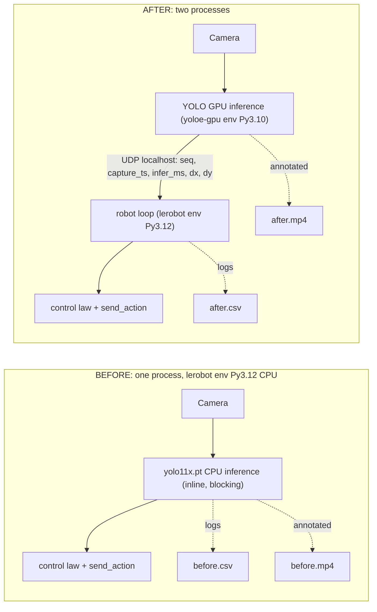
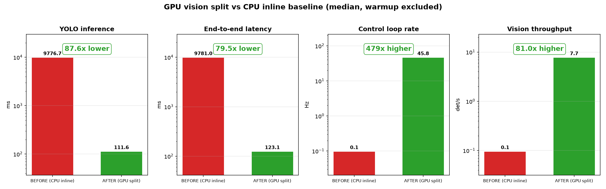
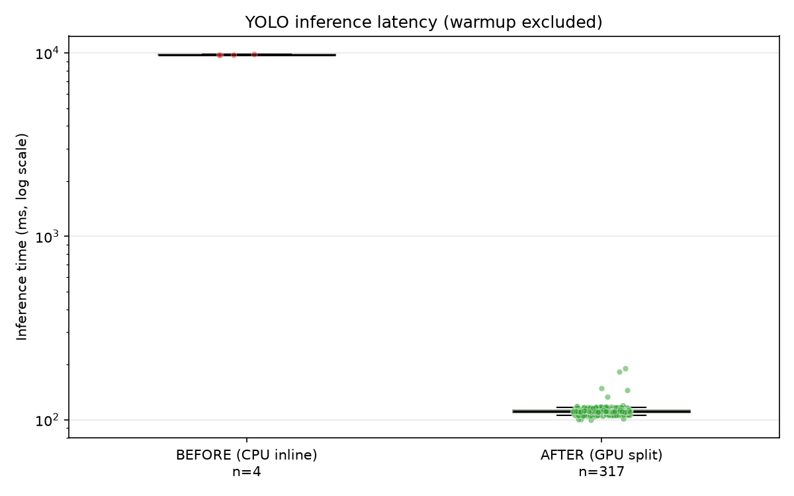
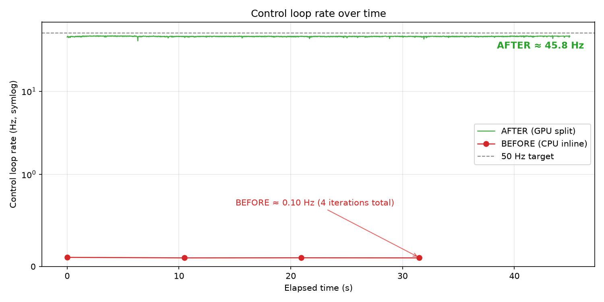
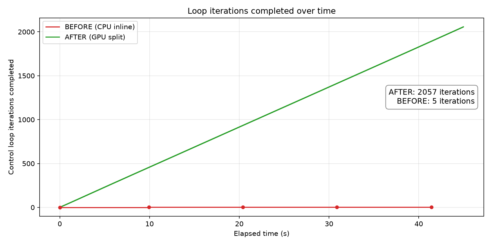
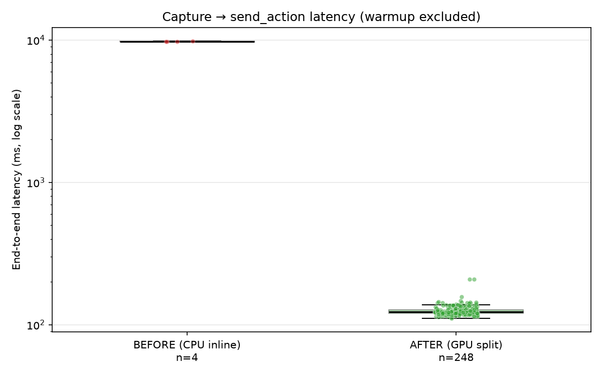
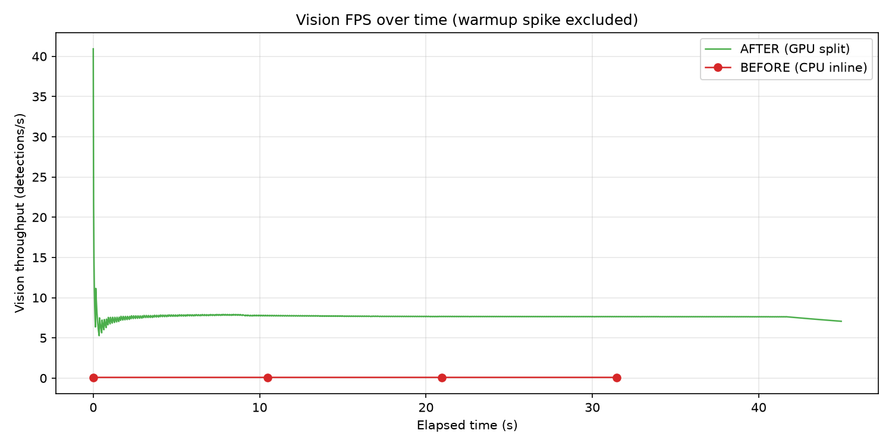
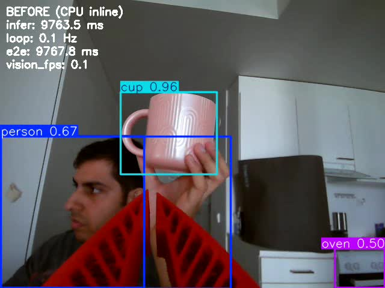
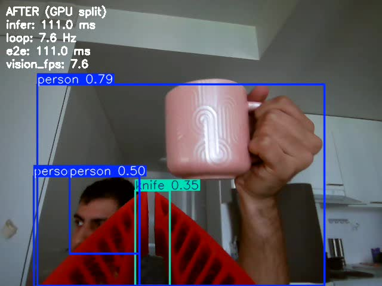

# YOLO End-Effector Follow: Latency Improvement Experiment

**Author:** Anshul  
**Date:** 2026-06-19  
**Hardware:** Jetson + SO100 arm + USB camera  
**Target object:** pink cup · **Run duration:** ~42 s per run

## Problem

The original follow script ([3_so100_yolo_ee_follow.py](../../3_so100_yolo_ee_follow.py)) runs `yolo11x.pt` **on CPU, inline inside the 50 Hz P-control loop**. Each loop iteration blocks on inference, starving the control loop and making the arm lag badly behind the target.

```python
results = model(frame)  # blocks the entire control loop
```

## Why not naive inline-GPU?

Jetson GPU PyTorch wheels are **Python 3.10 only**, while lerobot requires **Python 3.12**. You cannot run the robot control loop and CUDA YOLO in a single process/env on this platform. The fix is the same two-process split used for segmentation ([yoloe_segmentation_gpu.py](../../yoloe_segmentation_gpu.py)).

## Method

**Controlled variable:** where YOLO runs and how detections reach the loop.  
**Held constant:** IK, P-control gains, `K_pan` / `K_y`, calibration, keyboard mapping.



### Metrics

| Metric | Definition |
| --- | --- |
| `infer_ms` | Time spent in YOLO inference |
| `loop_hz` | Control loop iteration rate |
| `e2e_latency_ms` | Camera capture timestamp → `send_action` |
| `vision_fps` | Detections per second |

## Results

Both runs used the same pink cup and ~42 s duration. Numbers below are from
[logs/summary.md](logs/summary.md) (warmup sample `loop_idx == 0` excluded).

### Summary table

<!-- Auto-generated by plot_results.py → logs/summary.md. Warmup sample (loop_idx == 0) excluded. -->

| Run | infer ms (median) | infer ms (p95) | loop Hz (median) | e2e ms (median) | e2e ms (p95) | vision FPS (median) |
| --- | ---: | ---: | ---: | ---: | ---: | ---: |
| BEFORE (CPU inline) | 9776.7 | 9820.4 | 0.1 | 9781.0 | 9824.9 | 0.09 |
| AFTER (GPU split) | 111.6 | 117.2 | 45.8 | 123.1 | 141.2 | 7.65 |

**Improvement:** inference **87.6× lower**, end-to-end latency **79.5× lower**, control loop rate **479× higher**, vision throughput **81× higher**.

### Graphs

#### 0. Headline — improvement at a glance



_Median of each metric, log scale, warmup excluded. GPU split is ~80–480× better on every axis._

#### 1. Inference latency (log scale)



_Observation: BEFORE `yolo11x` on CPU takes ~9.8 s/frame; AFTER GPU inference is ~112 ms (per-sample points overlaid; sample counts shown because BEFORE only completed 4 detections)._

#### 2. Control loop rate over time



_Observation (symlog axis): BEFORE is stuck at ~0.1 Hz (each iteration blocks ~10 s on CPU inference); AFTER holds steady at ~45.8 Hz, just under the 50 Hz target._

#### 2b. Loop iterations completed over time



_Observation: in ~45 s the GPU split completes **2057** control iterations while the CPU baseline completes only **5** — the clearest picture of the loop stall._

#### 3. End-to-end latency



_Observation: capture→`send_action` drops from ~9.8 s to ~123 ms median (log scale, warmup excluded)._

#### 4. Vision throughput



_Observation: AFTER settles at ~7.7 detections/s; BEFORE flatlines near 0. The cold-start warmup spike is excluded so the steady state is visible._

### Footage

| Run | Clip | Notes |
| --- | --- | --- |
| BEFORE | [footage/before.mp4](footage/before.mp4) | Annotated feed with latency overlay; expect stuttery tracking |
| AFTER | [footage/after.mp4](footage/after.mp4) | GPU inference; smoother overlay and arm response |

#### Stills

<!-- Extracted at ~00:00:20 of each clip:
     ffmpeg -ss 00:00:20 -i footage/before.mp4 -frames:v 1 plots/before_still.jpg
     ffmpeg -ss 00:00:20 -i footage/after.mp4  -frames:v 1 plots/after_still.jpg
-->

| BEFORE | AFTER |
| --- | --- |
|  |  |

The overlay tells the story directly: BEFORE reads `infer: 9763.5 ms` / `loop: 0.1 Hz`,
while AFTER reads `infer: 111.0 ms`. Both frames track the same cup.

## Conclusion

Moving `yolo11x` off the CPU and out of the control loop is the difference between a
broken demo and a working one. With the only change being **where YOLO runs**, every
metric improved by ~1.9–2.7 orders of magnitude:

- **Inference:** ~9.8 s/frame → ~112 ms (**87.6× lower**). CPU `yolo11x` is simply too
  heavy to run inline; the GPU handles it in ~0.1 s.
- **Control loop:** the CPU baseline collapsed to ~0.1 Hz — each iteration blocked ~10 s on
  inference, so it completed only **5 iterations** in ~42 s. The GPU split held **~45.8 Hz**
  (just under the 50 Hz target) and completed **2057 iterations**, a **479×** higher rate.
- **End-to-end latency:** capture → `send_action` dropped from ~9.8 s to ~123 ms
  (**79.5× lower**), so the arm reacts to the target within a couple of control cycles
  instead of seconds later.
- **Tracking:** in the footage the baseline arm lurches once every ~10 s and lags far behind
  the cup, while the GPU split follows it smoothly and continuously.

**Takeaway:** on Jetson the bottleneck was never the IK or the arm — it was synchronous
CPU inference inside the loop. The two-process split (vision on the GPU in a Py3.10 env,
control in the lerobot Py3.12 env, joined over localhost UDP) keeps the control loop free
of inference work and makes real-time visual servoing feasible with a large model.

### Limitations / next steps

- The GPU run still sits below the 50 Hz target (~45.8 Hz) and vision throughput is
  ~7.7 detections/s; the loop interpolates between detections. A lighter model
  (`yolo11s`/`yolo11n`) or TensorRT export would raise detection rate further.
- The BEFORE run has only **5** usable samples, so its percentiles are coarse — they are
  reported for completeness, but the qualitative gap (seconds vs milliseconds) is what matters.
- Results are single-run; for a publishable number, average several runs per condition.

## Reproduce

See [README.md](./README.md).
